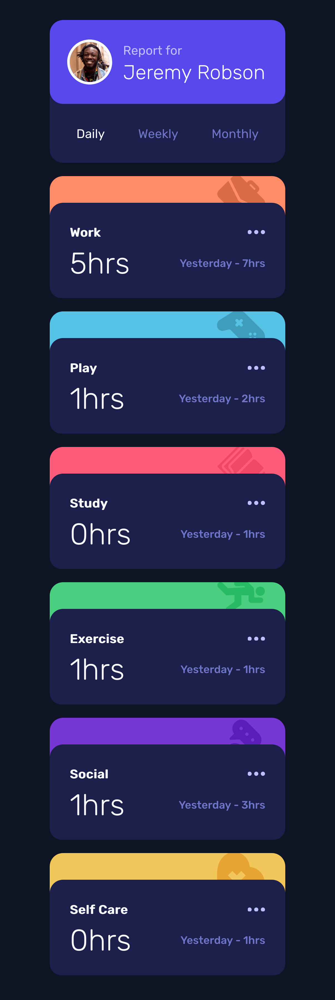
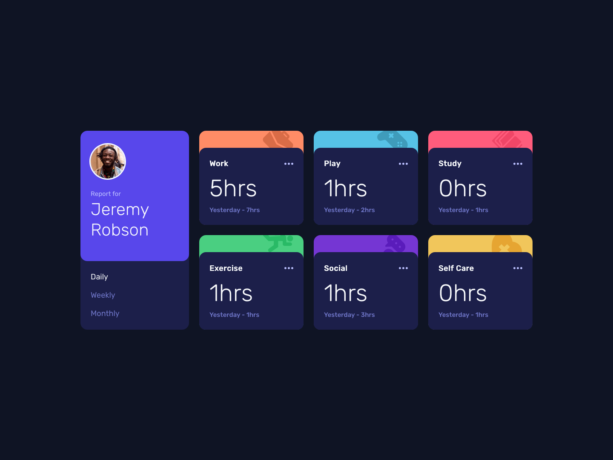

# Frontend Mentor - Time tracking dashboard solution

### The challenge

- View the optimal layout for the site depending on their device's screen size
- See hover states for all interactive elements on the page
- Switch between viewing Daily, Weekly, and Monthly stats

### Screenshots

<table>
  <tr>
    <td></td>
    <td></td>
  </tr>
  <tr>
    <td align="center">Mobile</td>
    <td align="center">Desktop</td>
  </tr>
</table>

### Links

- Solution URL: [GitHub repository](https://github.com/megamemma/time-tracking-dashboard)
- Live Site URL: [Live demo](https://time-tracking-dashboard-kappa-tan.vercel.app/)

### Built with

- Semantic HTML5
- CSS custom properties
- Flexbox / Grid
- Mobile-first
- Vanilla JS (fetch, DOM, events)

### What I learned

1. Dropped BEM mid-project — too much overhead for this size. Switched to flat, CUBE-inspired naming.
2. Pseudocode before syntax.
3. Width / height calc differences, tokens vs literals, other small CSS things, e.g.:
```css
.card-header {
    display: flex;
    justify-content: space-between;
    align-items: center; 
            /* seemingly did nothing bcs of same height (h2, button). 
            explicitly write out anyway. */
}
```
4. JSON-driven rendering:
```js 
async function init() {
    try {
        const response = await fetch('../data.json');
        data = await response.json();
        render();
    } catch (err) {
        console.error('Failed to load data.json', err);
    }
} 
```
5. Specificity bugs — found via DevTools Computed tab, not guessing.
6. A11y - readability cap.
7. Layers of grids and flexboxes do indeed shrink and behave weirdly in various window sizes.
8. Modern CSS reset.
9. Used Lighthouse first thing after deploying.
10. GitHub, Vercel, CodePen, some other tooling and their peculiarities.

### Continued development
1. Learn more: subgrid.
2. Make a11y audits a habit.
3. Tailwind CSS.
4. JS fundamentals - still shaky, next priority (before React). 

## Author
- Website - [GitHub](https://github.com/megamemma)
